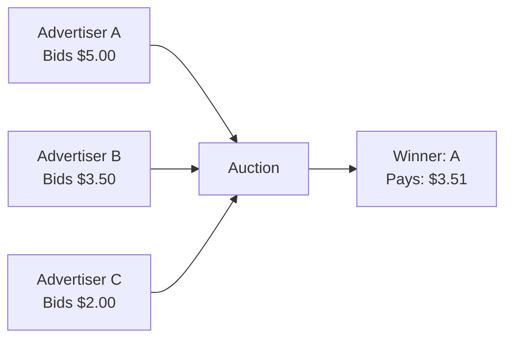

# How AttentionMarket Works

AttentionMarket is a transparent, fair marketplace that connects AI applications with relevant advertisers. Here's how our system ensures everyone wins - developers earn fairly, advertisers get results, and users see helpful content.

## The Fair Auction System

### Second-Price Auction Model

We use the same **second-price sealed-bid auction** model pioneered by Google and used across the industry. This Nobel Prize-winning mechanism ensures fair market pricing.



**Why Second-Price?**
- **Advertisers can bid their true value** without overpaying
- **Winners only pay $0.01 more** than the next highest bidder
- **Prevents bid manipulation** and encourages honest bidding
- **Proven fairness** - same system as Google Ads

### Quality Scores Matter

High-quality advertisers get rewarded with better placement and lower costs. Our system considers multiple performance factors including engagement rates, user experience, and relevance.

:::note
Quality scores are calculated using proprietary algorithms that continuously evolve. Higher quality leads to better placement and lower costs for advertisers.
:::

## How Matching Works

### Context-Based Relevance

We match ads to conversations using advanced semantic understanding:

1. **User sends message** → "I need car insurance for a new driver"
2. **We extract intent** → Insurance, automotive, new driver status
3. **We find matches** → Advertisers targeting these concepts
4. **We rank by relevance** → Most relevant ads score highest
5. **Auction determines winner** → Best combination of bid, quality, and relevance

### No User Tracking

Unlike traditional ad networks, we **never track users**:

- ✅ **No cookies** - Privacy-first approach
- ✅ **No personal data** - Only conversation context
- ✅ **No profiles** - Each request is independent
- ✅ **No retargeting** - Fresh relevance every time

## Earnings Transparency

### How Developers Earn

Your earnings come from successful ad engagement:

```
Your Earnings = Clearing Price × Click-Through Rate × Volume
```

**How Pricing Works:**
- **CPC**: Determined by advertiser bids in real-time auction
- **Fill Rate**: Depends on advertiser demand and context relevance
- **CTR**: Improves with better context and natural placement
- **Your Earnings**: Second-price auction ensures fair market value

### Real-Time Reporting

Track your earnings with complete transparency:

```typescript
// Every ad response includes payout information
{
  "payout": 250,        // You earn $2.50 if clicked
  "currency": "USD",    // Always in cents
  "clearing_price": 251 // What advertiser pays
}
```

## The Marketplace Advantage

### For Developers

- **Fair earnings** - Second-price ensures competitive payouts
- **Quality bonus** - Better UX = higher quality advertisers = more revenue
- **Transparent pricing** - See exactly what you earn per click
- **No hidden fees** - 100% of your earned revenue is yours

### For Advertisers

- **Fair pricing** - Never overpay with second-price auction
- **Quality rewards** - Better ads cost less through quality scores
- **Relevant placement** - Reach users at the right moment
- **Performance focus** - Pay only for actual engagement

### For End Users

- **Relevant content** - Ads match their actual needs
- **Privacy protected** - No tracking or data collection
- **Quality guaranteed** - Low-quality ads filtered out
- **Clear disclosure** - Always labeled as sponsored

## Trust & Safety

### Fraud Prevention

We protect the marketplace integrity through:

- **Click validation** - Advanced algorithms detect invalid clicks
- **Traffic quality** - Monitor for suspicious patterns
- **Rate limiting** - Prevent abuse and bot traffic
- **Manual review** - Human oversight for high-value campaigns

:::info
Our fraud detection methods are proprietary and constantly evolving. We don't disclose specific techniques to prevent circumvention.
:::

### Compliance & Standards

- **FTC Compliant** - Clear "Sponsored" labeling required
- **GDPR Ready** - No personal data processing
- **COPPA Safe** - No tracking of minors
- **Industry Standards** - Following IAB guidelines

## Common Questions

<details>
<summary>Why don't you share the exact auction formula?</summary>

While we're transparent about our principles (second-price, quality matters, relevance wins), sharing exact formulas would:
- Enable gaming and manipulation
- Reduce our ability to improve the system
- Compromise fraud prevention

We follow industry standards - Google, Facebook, and others also keep implementation details proprietary while being transparent about principles.
</details>

<details>
<summary>How often do quality scores update?</summary>

Quality scores update daily based on recent performance. Major changes in CTR or user feedback can impact scores within 24 hours.
</details>

<details>
<summary>Can advertisers see what they're competing against?</summary>

No. It's a sealed-bid auction - advertisers can't see other bids. They can see average CPMs for their category and performance metrics for their own campaigns.
</details>

<details>
<summary>How is relevance calculated?</summary>

We use semantic embeddings and machine learning to match ad content with user context. The exact models and weights are proprietary, but the goal is simple: show users ads they'll find helpful.
</details>

<details>
<summary>What prevents click fraud?</summary>

Multiple layers of protection:
- Server-side click validation
- Pattern detection algorithms
- Rate limiting and throttling
- Manual review for anomalies

Specific methods are kept confidential for security.
</details>

## What Makes Us Different

| AttentionMarket | Traditional Ad Networks |
|-----------------|------------------------|
| **Transparent auction model** | Black-box pricing |
| **Published quality factors** | Secret algorithms |
| **Real-time earnings data** | Delayed reporting |
| **No user tracking** | Extensive tracking |
| **Context-only matching** | Behavioral targeting |
| **Developer-first** | Advertiser-first |

## Learn More

- 📊 [Pricing & Earnings](/docs/pricing-earnings) - Detailed earnings information
- 🏢 [For Advertisers](/docs/for-advertisers) - Start advertising
- 🔒 [Trust & Safety](/docs/trust-safety) - Privacy and security details
- 🚀 [Get Started](/docs/quickstart) - Integration guide