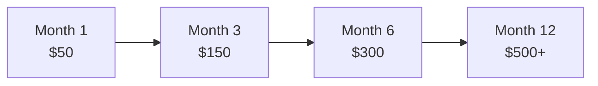

# Developer Pricing & Earnings

Transparent, competitive earnings for AI developers. No hidden fees, no complex calculations - just straightforward revenue from relevant ads.

## How You Earn

### Simple Revenue Model

```
Your Earnings = Successful Clicks × Payout Per Click
```

Every time a user clicks a sponsored link from your AI application, you earn the payout amount shown in the ad response. It's that simple.

### How Earnings Work

Your earnings depend on advertiser bids and competition:

| Factor | Description |
|--------|------------|
| **CPC** (per click) | Set by advertisers through bidding |
| **CTR** (click rate) | Varies by relevance and placement |
| **Fill Rate** | Depends on advertiser demand for your audience |

**Example calculation:**
```
Daily users × Messages per user × Fill rate × CTR × CPC = Earnings

Example scenario:
1,000 users × 5 messages × 30% fill × 3% CTR × $X advertiser bid = Your earnings
```

The actual CPC you earn is determined by our second-price auction - you get paid slightly more than the second-highest bidder.

## Payout Transparency

### See Earnings Before Clicks

Every ad response includes the exact payout:

```json
{
  "ad_type": "link",
  "payout": X,  // You earn this amount (in cents) per click
  "creative": {
    "title": "Example Promotion",
    "body": "Relevant to user context",
    "cta": "Learn More"
  },
  "click_url": "https://..."
}
```

The `payout` field shows exactly what you'll earn per click, determined by the second-price auction.

### No Hidden Fees

- ✅ **100% of earned revenue is yours**
- ✅ **No platform fees**
- ✅ **No minimum payout thresholds**
- ✅ **Weekly payment cycles**
- ✅ **Multiple payment methods** (ACH, Wire, PayPal)

## Factors Affecting Earnings

### 1. Content Relevance

Higher relevance leads to better advertiser competition:

| Context Quality | Bid Competition | Example |
|-----------------|----------------|---------|
| **High Intent** | Strong competition, higher bids | "I need car insurance today" |
| **Medium Intent** | Moderate competition | "Tell me about insurance options" |
| **Low Intent** | Lower competition | "What is insurance?" |

### 2. User Engagement Quality

Better UX = Better advertisers = Higher payouts

```typescript
// 🎯 Best Practice: Natural integration
const response = {
  ai_answer: "Here's what I found...",
  sponsored: {
    label: "Sponsored recommendation",
    content: ad.creative
  }
};

// ❌ Avoid: Disruptive placement
// Ads before answers, popup ads, misleading placement
```

### 3. Campaign Competition

Earnings depend on advertiser competition in your niche:

| Factor | Impact on Earnings |
|--------|-------------------|
| **Multiple Advertisers** | Higher prices from auction competition |
| **Quality Score** | Better quality = access to premium campaigns |
| **Relevance Match** | Higher relevance = higher clearing prices |
| **Time of Day** | Peak hours may see more competition |

Our second-price auction ensures you get the best possible price based on actual competition.

## Optimization Strategies

### 1. Implement Context-Aware Matching

Provide conversation context for better relevance:

```typescript
// Basic integration
const ad = await client.decideFromContext({
  userMessage: "insurance"
});

// Better: Include conversation context
const ad = await client.decideFromContext({
  userMessage: "insurance for new driver",
  conversationHistory: [
    "I just got my license",
    "Looking for affordable coverage"
  ]
});
// Context helps match more relevant promotions
```

### 2. Optimize Placement Timing

**Best times to show ads:**
- ✅ After providing value (answered their question)
- ✅ During natural breaks in conversation
- ✅ When user expresses commercial intent

**Avoid showing ads:**
- ❌ As the first response
- ❌ During error states
- ❌ Multiple ads in succession

### 3. Quality Score Optimization

Higher quality = Access to premium advertisers

```typescript
// Factors that improve quality score:
- Clear "Sponsored" labels (FTC compliance)
- Fast page load times
- Mobile-responsive design
- Good user experience metrics
- Low bounce rates on clicked ads
```

## Revenue Projections

### Calculation Examples

| App Type | Daily Active Users | Messages/Day | Monthly Revenue Formula |
|----------|-------------------|--------------|------------------------|
| **Small Chatbot** | 100 | 500 | 500 × fill% × CTR% × CPC × 30 days |
| **AI Assistant** | 500 | 2,500 | 2,500 × fill% × CTR% × CPC × 30 days |
| **Discord Bot** | 1,000 | 5,000 | 5,000 × fill% × CTR% × CPC × 30 days |
| **Enterprise Tool** | 5,000 | 25,000 | 25,000 × fill% × CTR% × CPC × 30 days |

*Actual revenue depends on advertiser demand, bid amounts, and user engagement*

### Growth Over Time



*Based on typical developer growth with consistent optimization*

## Payment Details

### Payment Schedule

- **Accrual Period**: Real-time
- **Payment Threshold**: $10 minimum
- **Payment Frequency**: Weekly (Thursdays)
- **Payment Methods**:
  - ACH (US) - No fees
  - Wire Transfer - $15 fee
  - PayPal - 2% fee
  - Cryptocurrency - Coming soon

### Tax Information

- **US Developers**: W-9 required, 1099 issued for $600+
- **International**: W-8BEN required, no US tax withholding
- **VAT**: Not applicable (B2B service)

## Earnings Dashboard

Track your performance in real-time:

```typescript
// API endpoint for earnings data
GET /developer-earnings

Response:
{
  "current_month": {
    "impressions": 45000,
    "clicks": 3600,
    "revenue": "$720.00",
    "ctr": "8.0%",
    "avg_cpc": "$0.20"
  },
  "pending_payout": "$180.00",
  "next_payment": "2026-03-06"
}
```

## Frequently Asked Questions

<details>
<summary>When do I get paid?</summary>

Payments are processed weekly on Thursdays for the previous week's earnings. You'll receive payment 3-5 business days after processing, depending on your payment method.
</details>

<details>
<summary>Is there a minimum payout?</summary>

Yes, $10 minimum for payment processing. Earnings below this threshold roll over to the next payment cycle.
</details>

<details>
<summary>How accurate are the payout amounts?</summary>

100% accurate. The payout shown in the API response is exactly what you earn per click. No adjustments, no clawbacks (except for proven fraud).
</details>

<details>
<summary>Can I set minimum CPC thresholds?</summary>

Yes! Use the `minPayout` parameter:

```typescript
const ad = await client.decideFromContext({
  userMessage,
  minPayout: X  // Set minimum payout in cents
});
```

This ensures you only show ads that meet your minimum earnings requirements.
</details>

<details>
<summary>What about refunds or chargebacks?</summary>

Advertisers pay upfront - there are no chargebacks. Once you've earned it, it's yours (unless fraudulent clicks are detected).
</details>

## Start Earning Today

Ready to monetize your AI application?

import Link from '@docusaurus/Link';

<div className="row margin-top--lg">
  <div className="col col--6">
    <div className="card">
      <div className="card__header">
        <h3>Quick Integration</h3>
      </div>
      <div className="card__body">
        <p>5-minute setup guide</p>
      </div>
      <div className="card__footer">
        <Link className="button button--primary button--block" to="/docs/quickstart">
          Start Integration
        </Link>
      </div>
    </div>
  </div>
  <div className="col col--6">
    <div className="card">
      <div className="card__header">
        <h3>Get API Keys</h3>
      </div>
      <div className="card__body">
        <p>Sign up for free access</p>
      </div>
      <div className="card__footer">
        <Link className="button button--primary button--block" href="https://developers.attentionmarket.ai">
          Get Your Keys
        </Link>
      </div>
    </div>
  </div>
</div>

## Questions?

- **Community**: [GitHub Discussions](https://github.com/rtrivedi/agent-ads-sdk/discussions)