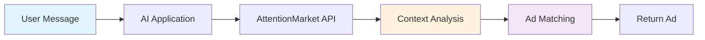

# Trust & Safety

AttentionMarket is built on a foundation of user privacy, developer trust, and advertiser confidence. Here's how we keep the marketplace safe and fair for everyone.

## Privacy First

### No User Tracking

We've built a privacy-first advertising system that **never tracks users**:

| What We DON'T Collect | What We DO Use |
|----------------------|----------------|
| ❌ Personal information | ✅ Conversation context |
| ❌ Cookies or device IDs | ✅ Semantic matching |
| ❌ Browsing history | ✅ Current intent |
| ❌ User profiles | ✅ Real-time relevance |
| ❌ Cross-site tracking | ✅ Single-session context |

### Data Handling



**What happens to user data:**
1. **Received**: Context from current conversation
2. **Processed**: Extract intent and match ads (in-memory)
3. **Discarded**: No storage of user messages
4. **Never shared**: Advertisers never see raw user data

### GDPR & CCPA Compliant

✅ **No personal data processing** - We don't collect PII
✅ **No consent required** - Context-only, no tracking
✅ **Right to deletion** - Nothing to delete (we don't store)
✅ **Data portability** - No user data to port

## Developer Protection

### Fraud Prevention

We protect legitimate developers from bad actors:

#### Click Fraud Protection
- **Server-side validation** - All clicks verified
- **Pattern detection** - Abnormal behavior flagged
- **Rate limiting** - Prevent click flooding
- **Device fingerprinting** - Without tracking users
- **Manual review** - Human oversight for anomalies

:::note Security Through Obscurity
Specific fraud detection methods are kept confidential to prevent circumvention. Our systems continuously evolve based on threat patterns.
:::

#### Payment Protection
- **No chargebacks** - Advertisers prepay
- **Guaranteed earnings** - Valid clicks always paid
- **Weekly payments** - Fast, reliable payouts
- **Fraud insurance** - We cover false positives

### Account Security

Protecting your developer account:

```typescript
// Best practices for API key security
const client = new AttentionMarketClient({
  apiKey: process.env.AM_API_KEY,  // Never hardcode
  agentId: process.env.AM_AGENT_ID
});

// Automatic security features:
// ✓ Rate limiting per API key
// ✓ IP allowlisting available
// ✓ Webhook signature verification
// ✓ TLS 1.3 encryption required
```

## Advertiser Safety

### Brand Safety Controls

Advertisers can control where their ads appear:

#### Category Blocking
```typescript
// Advertisers can block sensitive categories
blockedCategories: [
  601,  // Adult content
  602,  // Gambling
  603,  // Alcohol
  604,  // Political
]
```

#### Content Filtering
- **Keyword blocking** - Negative keyword lists
- **Sentiment analysis** - Avoid negative contexts
- **Topic filtering** - Control conversation themes
- **Quality thresholds** - Minimum app quality scores

### Ad Quality Standards

All advertisements must meet our standards:

✅ **Truthful** - No false claims or misleading content
✅ **Appropriate** - Family-friendly unless categorized
✅ **Legal** - Comply with all applicable laws
✅ **Transparent** - Clear sponsor identification

**Prohibited Content:**
- Illegal products or services
- Hate speech or discrimination
- Malware or phishing
- Pyramid schemes or MLM
- Unsubstantiated health claims
- Copyright infringement

## User Protection

### Clear Disclosure

All ads must be clearly labeled:

```typescript
// Required disclosure format
{
  disclosure: {
    label: "Sponsored",  // Required
    sponsor_name: "Acme Corp",  // Required
    explanation: "This is a paid advertisement"  // Optional
  }
}
```

**FTC Compliance:**
- ✅ "Sponsored" label required
- ✅ Clear visual distinction
- ✅ No deceptive formatting
- ✅ Honest recommendations

### Safe Click Experience

When users click ads:

1. **Transparent redirect** - See where they're going
2. **Safe browsing check** - Block malicious sites
3. **No automatic downloads** - User consent required
4. **Mobile-friendly** - Optimized landing pages
5. **Fast loading** - Performance standards enforced

## Compliance & Certifications

### Industry Standards

AttentionMarket follows industry best practices:

- **IAB Standards** - Following Interactive Advertising Bureau guidelines
- **TAG Certified** - Trustworthy Accountability Group member (pending)
- **Privacy Shield** - EU-US data transfer compliance
- **ISO 27001** - Information security management (in progress)

### Legal Compliance

| Regulation | Our Approach | Status |
|-----------|--------------|--------|
| **GDPR** | No personal data processing | ✅ Compliant |
| **CCPA** | No sale of personal information | ✅ Compliant |
| **COPPA** | No collection from minors | ✅ Compliant |
| **CAN-SPAM** | Email marketing rules | ✅ Compliant |
| **FTC Guidelines** | Clear ad disclosure | ✅ Compliant |

## Content Moderation

### Automated Screening

All ads are automatically screened for:

- ❌ Prohibited content
- ❌ Offensive language
- ❌ Misleading claims
- ❌ Policy violations

### Human Review

High-value campaigns receive manual review:

- 👀 New advertiser verification
- 👀 Large budget campaigns
- 👀 Sensitive categories
- 👀 User reported ads

### Community Reporting

Help us maintain quality:

```typescript
// Report problematic ads
await client.reportAd({
  tracking_token: ad.tracking_token,
  reason: 'misleading_content',
  details: 'Claims seem too good to be true'
});
```

## Security Architecture

### Infrastructure Security

- **Encryption**: TLS 1.3 for all connections
- **Authentication**: API key + agent ID verification
- **Authorization**: Role-based access control
- **Monitoring**: 24/7 security monitoring
- **Backup**: Hourly backups, geo-redundant

### API Security

```typescript
// All API requests are protected
POST /functions/v1/decide
Headers:
  X-AM-API-Key: am_live_xxx  // Authenticated
  Content-Type: application/json
  User-Agent: @the_ro_show/agent-ads-sdk/0.15.1

// Response includes security headers
X-Frame-Options: DENY
X-Content-Type-Options: nosniff
X-XSS-Protection: 1; mode=block
Strict-Transport-Security: max-age=31536000
```

## Incident Response

### Security Incidents

In case of security issues:

1. **Detection** - Automated monitoring alerts
2. **Assessment** - Security team evaluates
3. **Containment** - Isolate affected systems
4. **Resolution** - Fix and patch
5. **Notification** - Inform affected parties
6. **Review** - Post-mortem analysis

**Response Time SLA:**
- Critical: < 1 hour
- High: < 4 hours
- Medium: < 24 hours
- Low: < 72 hours

### Reporting Security Issues

Found a vulnerability? Please report it:

📧 **Email**: security@attentionmarket.ai
🔐 **PGP Key**: [Download public key](https://attentionmarket.ai/pgp)
🎁 **Bug Bounty**: Up to $10,000 for critical vulnerabilities

## Transparency Reports

We publish quarterly transparency reports including:

- Number of ads served
- Fraud prevention actions
- Policy violations removed
- Government data requests (none to date)
- Security incidents (if any)

## Developer Guidelines

### Best Practices for Safety

✅ **DO:**
- Use environment variables for API keys
- Implement proper error handling
- Keep SDK updated
- Report suspicious activity
- Follow FTC disclosure rules

❌ **DON'T:**
- Share API keys publicly
- Modify click tracking URLs
- Generate fake clicks
- Misrepresent ads as organic content
- Target inappropriate contexts

## Frequently Asked Questions

<details>
<summary>How do you prevent click fraud?</summary>

We use multiple layers of protection including server-side validation, pattern detection, rate limiting, and manual review. Specific methods are kept confidential for security.
</details>

<details>
<summary>Can advertisers see user data?</summary>

No. Advertisers never see raw user messages or any personal information. They only receive aggregated performance metrics.
</details>

<details>
<summary>What happens if I accidentally leak my API key?</summary>

Immediately regenerate your key in the developer dashboard. Old keys can be revoked instantly. We also monitor for leaked keys on public repositories.
</details>

<details>
<summary>How do you handle DMCA takedowns?</summary>

We respond to valid DMCA notices within 24 hours. Advertisers are responsible for their ad content and must have rights to all materials used.
</details>

<details>
<summary>Is AttentionMarket suitable for children's apps?</summary>

Yes, with restrictions. Children's apps must enable strict filtering and only receive age-appropriate ads. COPPA compliance is required.
</details>

## Contact Security Team

For security concerns or questions:

- 🔐 **Security Issues**: security@attentionmarket.ai
- 🛡️ **Privacy Questions**: privacy@attentionmarket.ai
- ⚖️ **Legal Inquiries**: legal@attentionmarket.ai
- 🚨 **Abuse Reports**: abuse@attentionmarket.ai

---

*Last Updated: February 2026 | [View Privacy Policy](https://attentionmarket.ai/privacy) | [View Terms of Service](https://attentionmarket.ai/terms)*