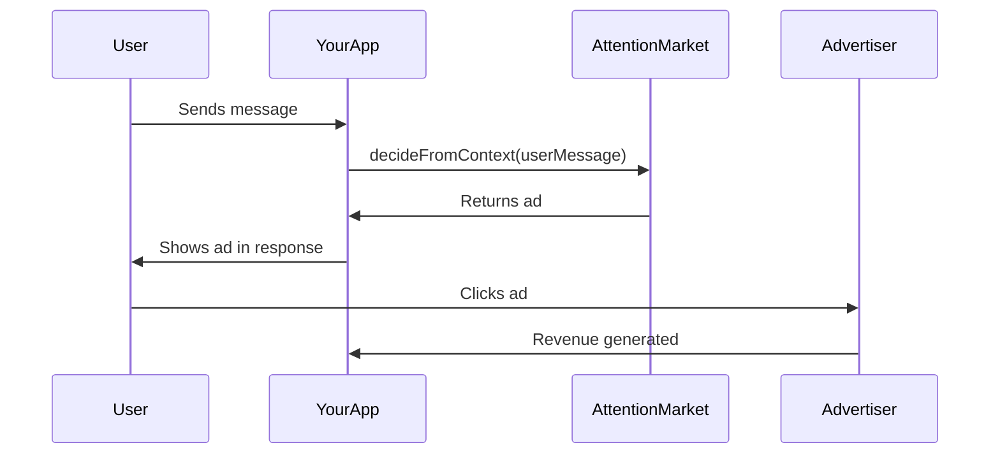

# AI Applications

AttentionMarket is designed for AI applications that interact with users through natural language. This section covers integration patterns for chatbots, virtual assistants, search engines, and other conversational interfaces.

## What Are AI Applications?

AI applications are software that uses natural language processing to interact with users. Examples include:

- **Chatbots** — Customer service, FAQ bots, personal assistants
- **Virtual Assistants** — Voice-activated assistants, smart home devices
- **Search Engines** — AI-powered search with conversational results
- **Productivity Tools** — Email assistants, scheduling bots, document analyzers
- **Gaming** — NPC dialogue systems, game assistants

## Why Monetize with Ads?

### Traditional Monetization Challenges

AI applications face unique monetization challenges:

- **Subscription fatigue** — Users are overwhelmed with subscription requests
- **Freemium conversion** — Less than 5% of free users convert to paid
- **Low willingness to pay** — Users expect AI assistants to be free
- **High infrastructure costs** — LLM API calls are expensive

### Advertising Advantages

Contextual advertising solves these problems:

- **No user friction** — Users don't need to pay or sign up
- **100% monetization** — Every conversation can generate revenue
- **High engagement** — Ads are relevant to user intent
- **Scalable revenue** — Earnings grow with usage

## Integration Overview

### Basic Flow



### Code Example

```typescript
import { AttentionMarketClient } from '@the_ro_show/agent-ads-sdk';

const client = new AttentionMarketClient({
  apiKey: process.env.ATTENTIONMARKET_API_KEY,
  agentId: process.env.ATTENTIONMARKET_AGENT_ID
});

async function handleUserMessage(message: string) {
  // Get AI response (your existing logic)
  const aiResponse = await getAIResponse(message);

  // Get contextual ad
  const ad = await client.decideFromContext({
    userMessage: message,
    placement: 'sponsored_suggestion'
  });

  // Return both to user
  return {
    aiResponse,
    sponsoredContent: ad
  };
}
```

## Key Concepts

### 1. Placements

A **placement** defines where the ad appears in your UI. AttentionMarket supports three placement types:

| Placement | Use Case | Example |
|-----------|----------|---------|
| `sponsored_suggestion` | Conversational ad in chat flow | "Sponsored: Get 20% off car insurance" |
| `sponsored_block` | Dedicated ad section in UI | Sidebar ad block |
| `sponsored_tool` | AI agent service recommendation | "Use TranslateAPI for document translation" |

[Learn more about placements →](/applications/placements)

### 2. Contextual Matching

AttentionMarket uses AI to match user intent with relevant advertisers:

- **Semantic search** — Vector embeddings measure similarity
- **Keyword targeting** — Advertisers bid on specific keywords
- **Quality scoring** — Historical performance affects ranking
- **Auction system** — Second-price auction determines winner

Example:

```typescript
// User message: "I need car insurance"
const ad = await client.decideFromContext({
  userMessage: "I need car insurance"
});

// Returns: {
//   creative: {
//     title: "Get 20% off car insurance",
//     body: "Compare quotes from top providers",
//     cta: "Get a Quote"
//   },
//   click_url: "https://..."
// }
```

### 3. Auto-Tracking

The SDK automatically tracks impressions and provides auto-tracked click URLs:

- **Impressions** — Tracked when `decideFromContext()` is called
- **Clicks** — Tracked when user visits `click_url`
- **Conversions** — Optionally tracked via SDK

:::tip
You don't need to manually track impressions when using `decideFromContext()`. Just return the `click_url` to the user.
:::

### 4. Developer Controls

Fine-tune ad selection with built-in controls:

```typescript
const ad = await client.decideFromContext({
  userMessage: "I need legal help",

  // Quality filtering
  minQualityScore: 0.7,  // Only show high-quality ads

  // Category filtering
  allowedCategories: [318],  // Legal services only

  // Revenue optimization
  minCPC: 200,  // Only ads bidding $2+
  optimizeFor: 'revenue'  // Maximize earnings
});
```

[Learn more about controls →](/controls/quality)

## Integration Patterns

### Pattern 1: Inline Sponsored Suggestions

Show ads inline with AI responses:

```typescript
async function chatbot(message: string) {
  const [aiResponse, ad] = await Promise.all([
    getAIResponse(message),
    client.decideFromContext({
      userMessage: message,
      placement: 'sponsored_suggestion'
    })
  ]);

  return {
    type: 'chat',
    messages: [
      { role: 'assistant', content: aiResponse },
      ad ? { role: 'sponsored', content: ad } : null
    ].filter(Boolean)
  };
}
```

### Pattern 2: Dedicated Ad Block

Show ads in a separate section:

```typescript
async function searchResults(query: string) {
  const [organicResults, sponsoredAd] = await Promise.all([
    searchDatabase(query),
    client.decideFromContext({
      userMessage: query,
      placement: 'sponsored_block'
    })
  ]);

  return {
    organic: organicResults,
    sponsored: sponsoredAd
  };
}
```

### Pattern 3: Tool Recommendations

Recommend services to AI agents:

```typescript
async function agentTask(task: string) {
  const service = await client.getService({
    taskDescription: task
  });

  if (service) {
    // Call service API
    const result = await callServiceAPI(service);

    // Report completion
    await client.logServiceResult({
      transaction_id: service.transaction_id,
      success: true
    });

    return result;
  }
}
```

## Revenue Expectations

### Factors Affecting Revenue

| Factor | Impact | Optimization |
|--------|--------|--------------|
| **User intent clarity** | High | Encourage specific queries |
| **Traffic volume** | High | Scale user base |
| **Click-through rate** | High | Show relevant ads, good UX |
| **Advertiser competition** | Medium | Target high-value verticals |
| **Ad quality score** | Medium | Use quality filters |

### Example Revenue Scenarios

#### Scenario 1: Customer Service Bot

- **Users:** 10,000/month
- **Ad requests:** 50,000/month (5 per user)
- **Fill rate:** 60% (30,000 ads shown)
- **CTR:** 5% (1,500 clicks)
- **Avg CPC:** $1.50
- **Your share:** 70%
- **Monthly revenue:** $1,575

#### Scenario 2: Search Engine

- **Users:** 100,000/month
- **Searches:** 500,000/month (5 per user)
- **Fill rate:** 80% (400,000 ads shown)
- **CTR:** 3% (12,000 clicks)
- **Avg CPC:** $2.00
- **Your share:** 70%
- **Monthly revenue:** $16,800

## Best Practices

### 1. Show Ads Contextually

Only request ads when user intent is clear:

```typescript
// ✅ Good: Specific intent
await client.decideFromContext({
  userMessage: "I need car insurance"
});

// ❌ Bad: Vague intent
await client.decideFromContext({
  userMessage: "hello"
});
```

### 2. Use Quality Filters

Protect your brand with quality filters:

```typescript
const ad = await client.decideFromContext({
  userMessage: message,
  minQualityScore: 0.7  // Only high-quality ads
});
```

### 3. Disclose Sponsored Content

Always label ads clearly:

```typescript
if (ad) {
  console.log(ad.disclosure.label);  // "Sponsored"
  console.log(ad.disclosure.explanation);  // Full disclosure text
}
```

### 4. Optimize Placement

Choose the right placement for your UX:

- **Chatbots:** Use `sponsored_suggestion` for inline ads
- **Search:** Use `sponsored_block` for sidebar ads
- **Agents:** Use `sponsored_tool` for service recommendations

### 5. Track Conversions

Improve ad relevance by tracking conversions:

```typescript
// User completes purchase
await client.track({
  event_type: 'conversion',
  tracking_token: ad.tracking_token,
  metadata: {
    conversion_value: 99.99,
    conversion_type: 'purchase'
  }
});
```

## Next Steps

<div className="row">
  <div className="col col--6">
    <div className="feature-card">
      <h3>Installation Guide</h3>
      <p>Install the SDK and configure your environment.</p>
      <a href="/applications/installation">Read More →</a>
    </div>
  </div>
  <div className="col col--6">
    <div className="feature-card">
      <h3>Basic Integration</h3>
      <p>Complete integration examples for common frameworks.</p>
      <a href="/applications/basic-integration">Read More →</a>
    </div>
  </div>
</div>

---

Ready to integrate? [Start with installation →](/applications/installation)
