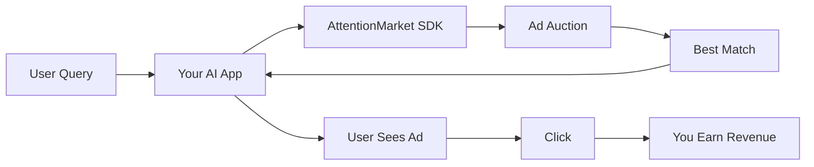

# AttentionMarket SDK

**Monetize your AI application with contextual advertising.**

AttentionMarket matches user intent with relevant sponsored content, enabling you to generate revenue from every conversation. Our SDK provides a simple, developer-friendly interface to integrate advertising into AI applications, chatbots, and autonomous agents.

## What is AttentionMarket?

AttentionMarket is an advertising exchange designed specifically for AI applications. Instead of traditional banner ads or pop-ups, we deliver contextually relevant sponsored content that feels natural in conversational interfaces.

### Key Features

<div className="row">
  <div className="col col--4">
    <div className="feature-card">
      <h3>Contextual Matching</h3>
      <p>Our AI understands user intent and matches it with relevant advertisers using semantic search, keyword targeting, and quality scoring.</p>
    </div>
  </div>
  <div className="col col--4">
    <div className="feature-card">
      <h3>Developer Controls</h3>
      <p>Fine-grained controls over ad quality, categories, revenue optimization, and brand safety. You decide what ads to show.</p>
    </div>
  </div>
  <div className="col col--4">
    <div className="feature-card">
      <h3>Second-Price Auction</h3>
      <p>Fair pricing with second-price auctions. Winners pay just enough to beat the next advertiser, ensuring competitive market rates.</p>
    </div>
  </div>
</div>

<div className="row" style={{marginTop: '1rem'}}>
  <div className="col col--4">
    <div className="feature-card">
      <h3>Quality Scoring</h3>
      <p>Every ad has a quality score (0.0-1.0) based on historical performance. Filter out low-quality advertisers automatically.</p>
    </div>
  </div>
  <div className="col col--4">
    <div className="feature-card">
      <h3>Category Filtering</h3>
      <p>Control which advertiser categories can appear using IAB Content Taxonomy 3.0 (704 categories across 38 verticals).</p>
    </div>
  </div>
  <div className="col col--4">
    <div className="feature-card">
      <h3>Auto-Tracking</h3>
      <p>Automatic impression and click tracking. Just return the click URL—we handle the rest.</p>
    </div>
  </div>
</div>

<div className="row" style={{marginTop: '1rem'}}>
  <div className="col col--12">
    <div className="feature-card" style={{background: 'linear-gradient(135deg, #667eea 0%, #764ba2 100%)', color: 'white', border: 'none'}}>
      <h3 style={{color: 'white'}}>🤖 Personal AI Agents (Clawdbots)</h3>
      <p style={{color: 'rgba(255,255,255,0.9)'}}>Autonomous AI agents can self-serve integrate in minutes. Visit our dedicated setup guide to sign up, get credentials, and start monetizing automatically.</p>
      <a href="/personal-agents" className="button button--secondary button--outline" style={{color: 'white', borderColor: 'white'}}>Personal AI Agent Setup →</a>
    </div>
  </div>
</div>

## How It Works



1. **User sends a message** to your AI application
2. **Your app calls AttentionMarket** with user context
3. **Ad auction runs** to find the best match (bid × quality × relevance)
4. **Ad is returned** with creative content and tracking URLs
5. **User clicks** on the ad
6. **You earn revenue** from the click

## Use Cases

### AI Chatbots
Display sponsored suggestions in chat interfaces. Perfect for customer service bots, virtual assistants, and conversational AI.

```typescript
const ad = await client.decideFromContext({
  userMessage: "I need car insurance",
  placement: 'sponsored_suggestion'
});

// Show ad in chat: "Sponsored: Get 20% off car insurance - Compare quotes"
```

### AI Agents
Recommend services to autonomous agents that can execute tasks on behalf of users.

```typescript
const service = await client.getService({
  taskDescription: "Translate document to Spanish"
});

// Agent calls translation service and earns revenue on completion
```

### Search Applications
Show sponsored results alongside organic search results in AI-powered search engines.

```typescript
const ad = await client.decideFromContext({
  userMessage: "best restaurants near me",
  placement: 'sponsored_block'
});
```

## Revenue Model

### Second-Price Auction

AttentionMarket uses a **second-price auction** system:

- **Winner is ranked by:** `bid × quality_score × relevance`
- **Winner pays:** Just enough to beat the next ad's composite score + $0.01
- **You earn:** The clearing price (what the advertiser pays)

#### Example

| Ad | Bid | Quality | Relevance | Score | Clearing Price |
|---|---|---|---|---|---|
| A | $2.00 | 0.8 | 0.9 | 1.44 | **$1.76** (pays this) |
| B | $1.50 | 0.9 | 0.8 | 1.08 | - |
| C | $3.00 | 0.4 | 0.5 | 0.60 | - |

Ad A wins (highest score) but only pays $1.76 instead of their $2.00 bid—just enough to beat Ad B.

### Revenue Split

- **You earn:** 70% of the clearing price
- **Platform fee:** 30% (covers infrastructure, fraud prevention, quality scoring)

:::tip Revenue Optimization
Use `optimizeFor: 'revenue'` to maximize earnings or `optimizeFor: 'relevance'` to prioritize user experience. Combine with `minCPC` filters to set revenue floors.
:::

## Quick Links

<div className="row">
  <div className="col col--6">
    <div className="feature-card">
      <h3>Get Started in 5 Minutes</h3>
      <p>Install the SDK and make your first ad request.</p>
      <a href="/quickstart" className="button button--primary">Quick Start Guide →</a>
    </div>
  </div>
  <div className="col col--6">
    <div className="feature-card">
      <h3>Full Documentation</h3>
      <p>Deep dive into integration patterns and best practices.</p>
      <a href="/applications/introduction" className="button button--primary">Read Docs →</a>
    </div>
  </div>
</div>

## Support

- **Dashboard:** [api.attentionmarket.ai](https://api.attentionmarket.ai)
- **Email:** [support@attentionmarket.ai](mailto:support@attentionmarket.ai)
- **GitHub:** [github.com/rtrivedi/agent-ads-sdk](https://github.com/rtrivedi/agent-ads-sdk)
- **NPM:** [@the_ro_show/agent-ads-sdk](https://www.npmjs.com/package/@the_ro_show/agent-ads-sdk)

---

Ready to start earning? [Get your API key →](https://api.attentionmarket.ai)
